(AI-assisted writeup)

# Living Dreaming Symbionts

**An experiment in giving AI companions goals people can inspect—and outcomes they can check.**

Imagine an agent helping a small community finish projects, share its work, or reflect on an experience. Before it acts, people decide what success would mean. Afterward, the result should come with more than the agent's own assertion that it did a good job.

Living Dreaming Symbionts supplies the verification step: it checks structured evidence against an agreed metric and produces a cryptographic receipt that someone else can verify. The result is **met**, **not met**, or **indeterminate**. A valid proof can report a failed goal.

This is a local research toolkit, originating in July 2025 and completed for public release in September 2026. It implements three metric families and a full input → calculation → saved receipt → independent verification path. The examples are entirely synthetic.

## Where it fits in an agent's experience



People and the agent work outside this toolkit. An operator supplies a record of what happened; the toolkit evaluates that record. The result can inform a human review or a later agent run. It does not run the agent, collect live social data, or distribute rewards.

The distinction matters: **the proof establishes that the agreed calculation ran on the committed evidence. It does not establish that the evidence is true, complete, or caused by the agent.** Authenticating sources is a separate part of the architecture.

## Three ways to describe a goal

| Goal | What gets checked | Example result |
| --- | --- | --- |
| Reach an audience | Add the views of unique posts for one account inside a specified time window. The total must strictly exceed the target. | Four posts total 45,000 views against a target of more than 30,000: **met**. |
| Complete a shared objective | Check the supplied resolution of the exact market and question named in the agreement. | YES: **met**. NO: **not met**. Unresolved or cancelled: **indeterminate**. |
| Learn from participants | Count consenting respondents whose positive answers meet a per-person threshold, then check the share of qualifying respondents. | Four of five respondents answer all four questions positively: **met** at an 80% / 80% threshold. |

At an 80% threshold, three positive answers out of four are insufficient: that is 75%. The survey calculation uses exact integer comparisons. A sample below the agreed minimum is indeterminate; incomplete answers, duplicate respondents, and nonconsenting submissions are rejected.

## How the proof works



1. **Agree.** Set the account, time window, market, or survey rules. Give this evaluation a unique run identifier. Keep the expected policy and evidence fingerprint independently of the prover.
2. **Supply evidence.** Provide individual post records, a market resolution, or classified survey answers. The system checks identities, duplicates, completeness, bounds, and metric-specific rules.
3. **Calculate and prove.** A small program inside RISC Zero recomputes the result. The saved receipt commits to the program, policy, evidence, and result.
4. **Verify and review.** The verifier checks the cryptographic receipt against its compiled program and the expectation it already trusts. Only then does it display the result.

The public result contains aggregate counts, the outcome, and fingerprints of the policy and evidence. Raw respondent IDs and answer arrays are not written to that result. Aggregates and hashes still reveal information; see the [trust and privacy model](docs/TRUST.md) before using sensitive data.

## Try it

Preview a synthetic example with the standard Rust toolchain; no accounts, API keys, or proof setup are needed:

```sh
cargo run --locked -p symbiont -- evaluate examples/participant-survey.json
```

The preview reports **met**, with five respondents and four qualifying respondents. It is explicitly labeled as a calculation preview, not a proof.

To generate and independently verify an actual receipt, follow the [proof walkthrough](docs/DEVELOPMENT.md#generate-and-verify-a-real-proof). The prover runs locally and never falls back to a simulated receipt. Development receipts are rejected even if development mode is enabled in the surrounding environment.

## Reading the code

- [Metric rules](crates/core/src/lib.rs): the shared policy, evidence validation, arithmetic, and commitments.
- [Proof boundary](crates/cli/src/proof.rs): local proving, cryptographic verification, and comparison with the verifier's expectations.
- [Regression tests](crates/core/tests/rules.rs): threshold edges, negative market outcomes, duplicates, tampering, and the limits of supplied evidence.

Build instructions and protocol details live in the [development guide](docs/DEVELOPMENT.md). The [design history](docs/DESIGN.md) explains the research idea and the public release's scope.

## Reflection

**What I'm proud of:** the separation between the goal, the evidence, and the verification. The interesting architectural choice is making an agent's success claim inspectable by someone who does not have to trust the agent's own summary. Small details—such as proving a negative result, binding the receipt to a specific agreement, and distinguishing missing evidence from failure—make that separation useful.

**What I'd improve next:** evidence collection and authentication. A mathematically correct calculation over fabricated or selectively collected data is still misleading. The next step is to connect authenticated sources, make collection completeness auditable, and study whether the chosen metrics actually reflect what participants value. Those are prerequisites for responsibly connecting results to incentives.

## License

[Apache-2.0](LICENSE). Created by Cassandra. This release retains the original project's license and documents its 2025 origins; the implementation and tests were substantially revised with coding-agent assistance for the 2026 release.
